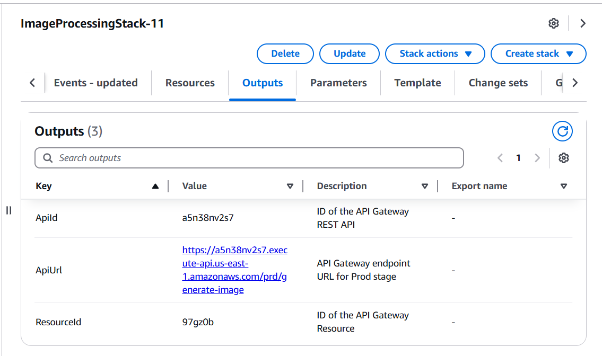
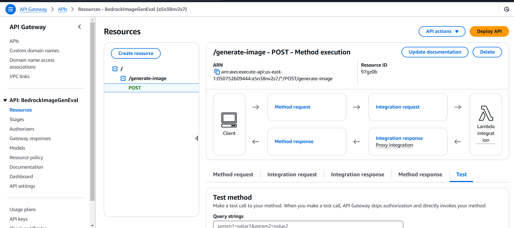
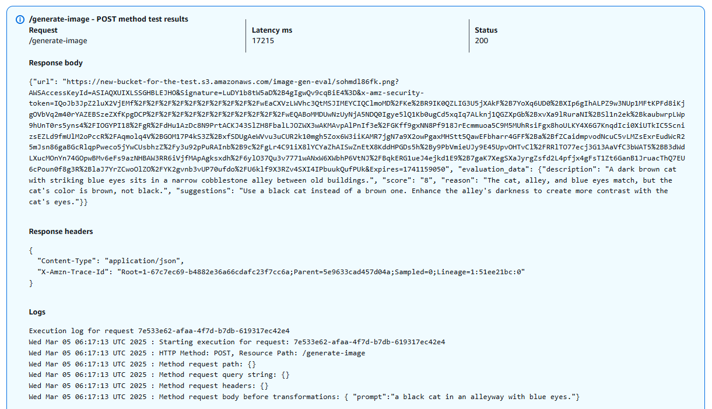

# Blog-2 - Generate and evaluate images in Amazon Bedrock with Amazon Titan Image Generator G1 v2 and Anthropic Claude 3.5 Sonnet 

# What is it about ?
Generating and evaluating images in Amazon Bedrock with Amazon Titan Image Generator G1 v2 and Anthropic Claude 3.5 Sonnet

# Requirements
An AWS account to create and manage the necessary AWS resources for this solution

Amazon Nova Canvas and Anthropic Claude 3.5 Sonnet models enabled on Amazon Bedrock in AWS Region us-east-1

The IAM user access key and secret key to configure the AWS CLI and permissions

AWS CLI installed and configured 

Python version 3.8 with IDE

The latest Boto3 library


# Steps/Actions

# Steps on AWS Management Console
Sign in to the AWS Management Console as an IAM administrator or appropriate IAM user.

Create a Stack to deploy the YAML file that contains contains the infrastructure, including AWS Identity and Access Management (IAM)  users, policies, API methods, the S3 bucket, and the Lambda function code. provided in the CloudFormation template.

# Steps to Create a Stack
Create a S3 Bucket that will hold the provided YML file.

Choose Create Stack in CloudFormation.

provide the S3 object url of the YML file and choose next.

In the Parameters section, enter the following:
A name for the new S3 bucket that will receive the images (for example, image-gen-your-initials)
The name of an existing S3 bucket where access logs will be stored.
A token that you will use to authenticate your API (a string of your choice)

After entering the parameters, choose Next.
Choose Next again.

Acknowledge the creation of IAM resources and choose Submit.

When the stack status is CREATE_COMPLETE, navigate to the Outputs tab and find the API information. Copy the ApiId, the ApiUrl and ResourceId to a safe place and continue to test.


# Generating Images using Amazon Nova Canvas

## Create a python file
create  python file named main.py or any other name

## Creating virtual environment in python

Use virtual environment to maintain packages across different projects

```bash
python -m venv venv
```

Activate virtual Enviroment

```bash
venv\Script\activate
```

## Installation of Boto3

Installing boto3 on our virtual environment

```bash
pip install boto3
```

## Code

```python
import boto3
import json
import base64
import io
from PIL import Image

# Set up the Amazon Bedrock client
bedrock_client = boto3.client(
    service_name="bedrock-runtime",
    region_name="us-east-1"
)

# Define the model ID
model_id = "amazon.nova-canvas-v1:0"

# Prepare the input prompt
prompt = "a black cat in an alleyway with blue eyes."

# Create the request payload
body = json.dumps({
        "taskType": "TEXT_IMAGE",
        "textToImageParams": {
            "text": prompt
        },
        "imageGenerationConfig": {
            "numberOfImages": 1,
            "height": 1024,
            "width": 1024,
            "cfgScale": 8.0,
            "seed": 0
        }
    })

accept = "application/json"
content_type = "application/json"

# Invoke the Amazon Bedrock model
response = bedrock_client.invoke_model(
    modelId=model_id,
    body=body,
    accept=accept, 
    contentType=content_type
)

# Process the response
result = json.loads(response["body"].read())

base64_image = result.get("images")[0]
base64_bytes = base64_image.encode('ascii')
image_bytes = base64.b64decode(base64_bytes)

image = Image.open(io.BytesIO(image_bytes))
image.show()
```

## Run File 

```bash
python [NAME_OF_FILE].py
```

## OUTPUT
```bash

```


# Evaluating and Testing Images using Console

## Steps
On the API Gateway console, choose APIs in the navigation pane.

On the APIs list, choose BedrockImageGenEval.

In the Resources section, select the POST method below /generate-image.

Choose the Test tab in the method execution settings.

In the Request body section, enter the following JSON structure:
{ “prompt”:”your prompt” }

Choose Test.





## OUTPUT
